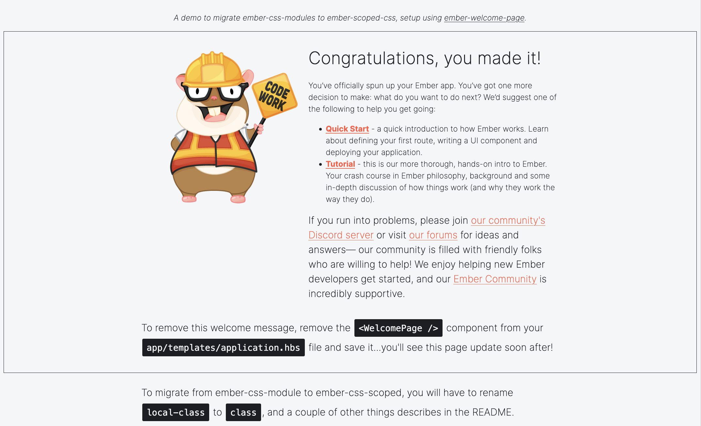

# css-modules-to-scoped-css

This repository serves as a demo to migrate from [ember-css-modules](https://github.com/salsify/ember-css-modules) to [ember-scoped-css](https://github.com/soxhub/ember-scoped-css).

## Motivation

The Ember community wants to bring Vite to Ember apps. As part of the [Ember Initiative](https://mainmatter.com/ember-initiative/) led by Mainmatter, the Ember Initiative team started an audit of the top 100 addons on [Ember Observer](https://emberobserver.com/). Are these addons compatible with modern Ember apps building with Vite? Do some of them require rework? Or even should they be abandonned in favor of a different solution?

[ember-css-modules](https://github.com/salsify/ember-css-modules) is a widely used addon that brings CSS modules to classic Ember apps. However, it was identified as an addon that should be replaced with a different solution before moving to `@embroider/vite`. The problem is that it relies too much on classic-world semantic, and new options came up to bring CSS modules to modern Ember apps.

This repository introduces one of these options: [ember-scoped-css](https://github.com/soxhub/ember-scoped-css). It gives an example of how to migrate a simple application from ember-css-modules to ember-scoped-css. Though it remains rather minimalist (it doesn't introduce any advanced plugin configuration that you can use with ember-css-modules), it tries to show an overwiew of ember-css-modules features and how you can achieve the same with ember-scoped-css.

### I want to start using CSS modules in my Ember Vite app, should I use ember-scoped-css?

No, not necessarily; ember-scoped-css is not the only option. You could also follow [Vite documentation](https://vite.dev/guide/features#css-modules) directly or look into what the Ember community came up with. The advantage of ember-scoped-css is that it's quite similar to ember-css-modules in the way the implementation is structured, so it's a migration path we recommend to unblock your upgrade to Vite without changing drastically all your CSS.

## How to use this repo

### A demo inspired by ember-welcome-page

The `6.2` classic app in this repository is inspired by [ember-welcome-page](https://github.com/ember-cli/ember-welcome-page). For the setup, a `<WelcomePageCopy />` component has been implemented directly in the application. Starting from there, I introduced changes that allow me to demo ember-css-modules features.



### View the before/after

Starting from the version using ember-css-modules, I migrated to ember-scoped-css:

✨ --- [**Click here to see the diff**](https://github.com/BlueCutOfficial/css-modules-to-scoped-css/compare/demo-ember-css-modules..demo-ember-scoped-css?diff=split&w=) --- ✨

In the "Walkthrough the diff" below, we will go through an overview of the differences between both solutions.

### Try it yourself

To have a better understanding of the "Walkthrough the diff" below, you might feel the need to see the whole resulting CSS and even experiment things in the browser. To help you doing this as easily as possible, this repository contains two folders `dist_ember-css-modules` and `dist_ember-scoped-css` that each correspond to a dev build of each diff branch.

- `git clone <this repository URL>`
- In a terminal, run `npx http-server dist_ember-css-modules`
- In another terminal, run `npx http-server dist_ember-scoped-css`

By visiting the the ruturned URLs (http://127.0.0.1:8080 and http://127.0.0.1:8081 by default), you can now view both dev builds side by side and inspect the CSS.

But before digging into the differences, let's see the main idea behind "CSS isolation" that both addons implement more or less the same way.

## CSS isolation by class rename

ember-css-modules and ember-scoped-css both allow you to isolate your components styles by creating a CSS file alongside you component template. They are different, but they both work following the same general idea: "CSS isolation by class rename". To understand this approach, you can use two resources:

- The document [CSS Isolation](https://github.com/soxhub/ember-scoped-css/blob/main/docs/css-isolation.md) from ember-scoped-css repository.
- The article [Cookbook: migrate an existing Ember app to CSS modules](https://mainmatter.com/blog/2022/08/24/cookbook-ember-app-to-css-modules/) is a walkthrough to install ember-css-modules in an Ember application that used initially one global CSS file. It presents the introduction of CSS modules with a more "practical" angle that allow you to see clearly the "without / with" CSS modules.

To sum it up, ember-css-modules and ember-scoped-css both provide you ways to have your `custom-class` and a component's element renamed to `custom-class+sha` following an interpolation pattern. This way, this class becomes unique and applied only on this specific component. ember-css-modules rename the classes to `._custom-class_sha`, and ember-scoped-css rename the classes to `.custom-class_sha`, but let's not call this a difference.

There are a few major differences though that will force you to rework your code while migrating from one to the other.

## Walkthrough the diff

### 1. `local-class` _versus_ `class`

ember-css-modules introduces the attribute `local-class` has a marker that identifies scoped classes. In a template, it's your responsability as a developer to assign to `local-class` the scoped classes that you defined in the corresponding CSS module, and to assign to `class` the global classes.

In ember-scoped-css, you only use the attribute `class`. If the class name is defined in the CSS module, it will be transformed, else it just stays what it is and the global styles apply.

### 2. Tag selectors: global _versus_ local

ember-css-modules is designed to rename class selectors. It doesn't rename tag selectors like `div`, `p`, `img`, `a`... even when they are defined in the CSS module of a component. These selectors are bundled as is in the final style and therefore the style applies globally. In that way, using tag selectors in components when using ember-css-modules requires caution.

ember-scoped-css is a bit more intuitive on that field. The tag selectors are no longer global but scoped. When these selectors are used in the component's CSS, a class named after the `sha` is added to the corresponding DOM elements, and the syntax `selector.sha` is used CSS-side to scope the style only to the component. This way, tag selectors behave just like any class selector, which can bring clearness to the CSS module.

```html
<!-- Final DOM -->
<ul class="e9accf110">
  <li class="e9accf110"></li>
</ul>
```

```css
/* Built CSS */
ul.e9accf110 > li.e9accf110 {
  padding-bottom: 0.5em;
  font-size: 1.1em;
}
```

### 3. Id selectors: weird _versus_ global

ember-css-modules behavior with ids is a bit weird. It doesn't rename elements ids in the DOM, but it transforms them in the CSS. As result, if you use HTML ids to style the component, the styles are not applied.

```html
<!-- Final DOM -->
<main id="ember-welcome-page-id-selector"></main>
```

```css
/* Built CSS */
#_ember-welcome-page-id-selector_f42zxn {
  padding: 2em;
  border-style: solid;
  border-width: 1px;
}
```

ember-scoped-css, on the other hand, tries to be a bit smarter on that field. It considers the following HTML principle: the HTML id should be unique in the document. Therefore, ember-scoped-css doesn't transform ids at all and the style remains global.

### 4. Each CSS file is a CSS module _versus_ each component has its CSS module

In ember-css-modules, each CSS file in your `app/styles/` folder is considered a CSS module, and all the classes in there are scoped. This approach allows you to scope the CSS of route controllers. For instance, the local CSS of your `application.hbs` is expected to be defined in `app/styles/application.css`. The class names transform also applies to `app/styles/app.css`. Each time you want to apply a style globally using a class name, you need to use `:global` pseudo-selector.

ember-scoped-css is more... "scoped". The idea of this addon is to scope your components CSS by creating a `component.css` alongside a `component.hbs`. On the other hand, `app/styles/app.css` contains global CSS, and if you have other global CSS files they should be explicitly imported.

### 5. Importing styles and properties _versus_ parent passes in to child

#### ember-css-modules specific features

ember-css-modules has three specific features:

`{{local-class}}` helper imports a local class from another CSS module directly in the template.

```hbs
<p class="{{local-class 'postscript' from='css-modules-to-scoped-css/components/welcome-page-copy.css'}}">
```

`composes` gets a local class inherit from another local class that could be located in another CSS module.

```css
.guide {
  composes: guide from 'css-modules-to-scoped-css/components/welcome-page-copy.css';
  font-weight: bold;
}
```

`@value` imports a CSS variable that could be located in another CSS module.

```css 
/* app/styles/app.css */
@value ember-orange: rgb(255, 92, 68);

/* app/components/welcome-page-copy.css */
@value ember-orange from 'css-modules-to-scoped-css/styles/app';
```

All of these features are based on the same idea: given the path to a CSS module, the content of this CSS module can be imported in another CSS module. Phrased this way, the approach sounds inspired from importing js modules in our code files, but applied to CSS with a very specific semantic.

#### Alternatives in ember-scoped-css

`{{scoped-class}}` helper we be used to pass a local class from the parent component to the child component, which results in something similar to the former `{{local-class}}`. The approach is still very different: the scoped class is passed in from the component that defines it (rather than any component can retrieve the scoped class from anywhere given the path), and since only components have their CSS scoped, we can't use that helper from outside a component (because outside a component we are not in a CSS module with scoped classes to pass in).

CSS variables: instead of relying on `@values`, we can try to rework the styles with [CSS custom properties](https://developer.mozilla.org/en-US/docs/Web/CSS/CSS_cascading_variables/Using_CSS_custom_properties) (also called CSS variables) directly.

### 6. Classic cascading _versus_ providing layers

ember-css-modules transforms the class names but doesn't take any initiative such as emitting layers.

By default, ember-scoped-css emits the components CSS in a [CSS layer](https://developer.mozilla.org/en-US/docs/Web/CSS/@layer) `components`. The name of the layer is [configurable](https://github.com/soxhub/ember-scoped-css/blob/02488a40003923409ffc1ab3fdd1bd6bed7eddaf/README.md#configuration-1), and if you don't use layers at all you can disable this with `layerName: false`.
